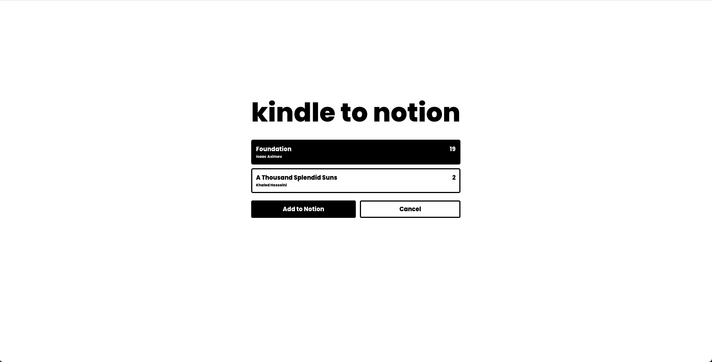
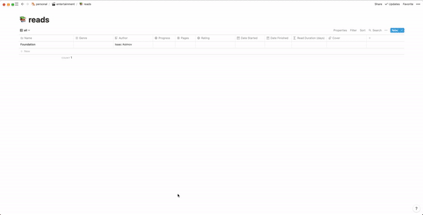

# kindle to notion

### description:
upload kindle clippings to notion reads database via [the notion api](https://developers.notion.com/). 
built with react + typescript and serverless on aws. hosted on aws amplify. as of currently, due to some restrictions of the notion api, this is built for my personal database and therefore the link is not available for the public. 

### demo:

  

